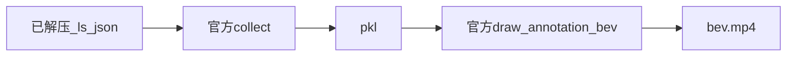
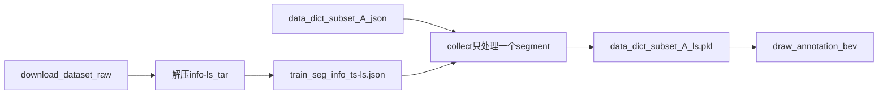

# 生成 BEV 视频

## 可行性

已有数据集`train/00000` 的 32 个 `*-ls.json`、`data_dict_subset_A.json`。

- **新增** `BEV/` 目录下的文件：
  - `BEV/config.py`：两脚本全部可配置参数（路径、自车尺寸、渲染默认、检测阈值）的单一来源
  - `BEV/main.py`：一键编排——重新判定压线/变道 + 渲染 online/lanechange 两组 BEV 视频
  - `BEV/render_bev_video.py`
  - `BEV/filter_driving_behavior.py`：压线/变道行为筛选（步骤 6）
  - `BEV/pyproject.toml`：独立 uv 环境
  - `BEV/.gitignore`：`.venv/`、`.python-version`、`vis/`、`out/`
- 脚本用 `sys.path` 指向仓库根 `import openlanev2`，不 `setup.py develop`、不改官方包。

## 目标

用官方 `collect` + `draw_annotation_bev` 把 `train/00000` 的 lane segment 真值画成 `BEV/vis/bev_00000/bev.mp4`。

在 `BEV/` 用 uv 锁定官方 Python 3.8 + 仓库根 `requirements.txt` pin。**不改**根目录 `pyproject.toml`。



---

## 实施文件

| 路径 | 作用 |
|------|------|
| `BEV/config.py` | 全部可配置参数的单一来源（路径/自车/渲染/检测阈值），两脚本 import；CLI 可覆盖默认值 |
| `BEV/main.py` | 一键重判定 + 重渲染两组行为视频（串联 filter/render，含 dry-run、分步开关）；渲染完成后写 `BEV/result.md`（已渲染段清单：segment_id/line_type/direction/start_time/end_time） |
| `BEV/pyproject.toml` | 官方 3.8 + requirements pin + openxlab |
| `BEV/render_bev_video.py` | `--prepare-data` / `--preprocess` / `--no-render` / 渲染；`--fps` 默认 2、`--per-segment` 输出 `<split>/<segment>/`、画面烧 `t=` |
| `BEV/filter_driving_behavior.py` | 压线（online）/完整变道（lanechange）行为筛选，判定对齐 `prompts/`，产出 `BEV/out/` |
| `BEV/.gitignore` | `.venv/`、`.python-version`、`vis/`、`out/` |

在 `BEV/` 执行 `uv python pin 3.8` 与 `uv sync`。 `--prepare-data` 解压info-ls。

---

## 步骤 1：环境

### `BEV/pyproject.toml`

对应官方 Python 3.8 + `requirements.txt`。**不**改根目录 pyproject，**不** `setup.py develop`。脚本自行把仓库根加入 `sys.path`。

```toml
[project]
name = "openlanev2-bev"
version = "0.1.0"
description = "OpenLane-V2 BEV video helpers"
readme = "BEV.md"
requires-python = ">=3.8,<3.9"
dependencies = [
    "openxlab>=0.1.3",
    "tqdm",
    "ninja",
    "jupyter",
    "openmim",
    "matplotlib>=3.3,<3.8",
    "numpy>=1.22.0,<1.24.0",
    "scikit-learn",
    "similaritymeasures",
    "opencv-python",
    "scipy==1.8.0",
    "iso3166",
    "chardet",
    "shapely==2.0.0",
]

[tool.uv]
exclude-newer = "2024-06-01T00:00:00Z"
exclude-newer-package = { openmim = false, openxlab = false, cycler = false }
environments = ["sys_platform == 'win32'"]
```

```bash
cd BEV
uv python pin 3.8
uv sync
uv run python render_bev_video.py --help
```


`BEV/.gitignore`：

```
.venv/
.python-version
vis/
out/
```

---

## 步骤 2：数据处理

数据要经过：校验已解压的 `*-ls.json` → `collect` 处理单段或行为子集 → 生成 pkl → `draw_annotation_bev`。



### 2.1 解压 info-ls

`--prepare-data` 解压`tar -xf ... -C data/OpenLane-V2`：

- `data/OpenLane-V2/{train,val,test}` 在（train 700 / val 150 / test 150 段）
- `data/OpenLane-V2/train/00000/info/` 有 **32** 个 `*-ls.json`，与 `data_dict_subset_A.json` 里 `train/00000` 的 32 个 timestamp **一一对应**
- `data_dict_subset_A.json` 仍在 `data/OpenLane-V2/`
- **已生成** `data/OpenLane-V2/data_dict_subset_A_ls.pkl`（单段）、`data/OpenLane-V2/data_dict_subset_A_online_ls.pkl`（online 整段 6,136 帧）与 `data/OpenLane-V2/data_dict_subset_A_lanechange_ls.pkl`（lanechange 整段 1,536 帧）——prompt 对齐 + 多次变道输出口径（2026-09 重跑）
- `data/OpenLane-V2/train/00000/image` **没有**（相机图在 download_dataset 的 image_0 包里，渲染 `--copy-images` 时复制过去）

### 2.1b 解压前的 OpenXLab 原始布局

```
download_dataset/OpenDriveLab___OpenLane-V2/raw/
  OpenLane-V2_subset_A_info/          已解压：train/val/test，仅 {timestamp}.json
  OpenLane-V2_subset_A_info-ls/OpenLane-V2_subset_A_info-ls
                                     无后缀 ustar（约 1GB，文件头 test/）
  OpenLane-V2_subset_A_image_0/       已解压：仅 train/00000–00099 图像
```

仓库内已有清单：`data/OpenLane-V2/data_dict_subset_A.json`（被 gitignore 例外保留）。

| 文件 | 本计划 | 现状 |
|------|--------|------|
| `*-ls.json` | 必需 | **已解压**到 `data/OpenLane-V2/` |
| `{ts}.json` 中心线 | 不用 | 在 download 的 info 包里，不能替代 `-ls` |
| `data_dict_subset_A.json` | 必需 | 已在 `data/OpenLane-V2/` |
| 相机图 | 可选 | 在 download_dataset 的 image_0 包里（仅 train/00000–00099），渲染时 `--copy-images` 按需复制 |

官方 `collect()`（`openlanev2/lanesegment/preprocessing/collect.py`）读：

```
{root}/{split}/{segment_id}/info/{timestamp}-ls.json
```

`timestamp` 来自 data_dict 里的文件名去掉 `.json`。不要把 `--root` 指到 `download_dataset` 根目录。

### 2.2 解压 Map Element Bucket（info-ls）

目标 root 固定为 `data/OpenLane-V2/`，与 `data/README.md` hierarchy 一致。tar 顶层就是 `train/` `val/` `test/`，解到该目录即可，不要多套一层。

用户已执行过：

```bash
tar -xf download_dataset/OpenDriveLab___OpenLane-V2/raw/OpenLane-V2_subset_A_info-ls/OpenLane-V2_subset_A_info-ls -C data/OpenLane-V2
```

脚本里用 `tarfile` 做幂等解压（当前实现，见 `render_bev_video.prepare_data`）：

- 校验目标 = `config`/CLI 指定的 `--split`/`--segment`；当任一为 `all` 时改用 `--data-dict` 里过滤出的全部段逐段检查 `*-ls.json`
- 全部已存在 → 跳过解压；有缺段 → 解整包 tar（约 1GB），解压后仍缺则抛 `FileNotFoundError`
- 过滤后无任何段（split 名错等）→ 解压前直接 `ValueError`，不白解 tar；`all` 且读不到 data_dict 同样提前报错

解压后期望：

```
data/OpenLane-V2/
  data_dict_subset_A.json
  train/00000/info/3159...-ls.json
  val/...
  test/...
```

只认 `-ls.json`。不拷贝中心线 info 包，不拷贝 `image_0`。

### 2.3 collect：只处理一个 segment

禁止对 `data_dict_subset_A.json` 全集跑 `data/OpenLane-V2/preprocess-ls.py`。脚本 `--preprocess --only-segment` 只切出 `train/00000`（行为视频则对 filter 产出的子集 data_dict 跑 collect，同样非全集）：

```python
data_dict = io.json_load(f"{root}/{data_dict_name}")
data_dict = {split: {segment: data_dict[split][segment]}}
collect(
    root,
    data_dict,
    collection,        # data_dict_subset_A_ls
    with_sd_map=C.WITH_SD_MAP,   # 默认 False（subset_A 无 sdmap）
    n_points=C.N_POINTS,         # {"area":20,"centerline":10,"left/right_laneline":20}
)
```

`collect` 会：读每帧 `-ls.json`、pose/内外参转 numpy、车道/区域插值、写出 `{root}/{collection}.pkl`。缺 `-ls.json` 会在这一步失败。

默认参数：

- `--root data/OpenLane-V2`
- `--data-dict data_dict_subset_A.json`
- `--collection data_dict_subset_A_ls`
- `--segment 00000`

### 2.4 校验清单（prepare 结束必须打印）

- `data/OpenLane-V2/train/00000/info` 下至少 1 个 `*-ls.json`
- `data/OpenLane-V2/data_dict_subset_A.json` 存在
- `--preprocess` 后存在 `data/OpenLane-V2/data_dict_subset_A_ls.pkl`
- pkl 体积合理（单段通常远小于全集）

### 2.5 一次跑完数据处理 + 渲染

```bash
cd BEV
uv run python render_bev_video.py --prepare-data --preprocess --only-segment
```

`--prepare-data` 只解压并校验；`--preprocess` 生成 pkl；随后默认渲染 `train/00000`。

---

## 步骤 3：`BEV/render_bev_video.py`（不改官方源码）

实现要点（**以 `BEV/render_bev_video.py` 实际文件为准**）：`--fps` 默认 2、`--per-segment` 输出 `<split>/<segment>/`、画面烧 `t=`、`--no-render`、按 data_dict 缺段决定是否解压。

文件开头把仓库根加入 `sys.path`：

```python
REPO_ROOT = Path(__file__).resolve().parents[1]
if str(REPO_ROOT) not in sys.path:
    sys.path.insert(0, str(REPO_ROOT))
```

默认 `--root` 用 `REPO_ROOT / "data/OpenLane-V2"`，`--info-ls-tar` 相对仓库根。

对齐 `tutorials/LaneSegment.ipynb` 与 `openlanev2/lanesegment/visualization/bev.py`。

启动渲染时打印：`官方 collect / draw_annotation_bev，CPU 绘制标注 BEV。`

完整参数与实现见 `BEV/render_bev_video.py` 与 `--help`，本文不再内嵌脚本全文。

画布尺寸由 `config.BEV_SCALE / BEV_RANGE` 决定（官方默认 10 与 `[-50,50,-25,25]` → 1000x500）；脚本在 `main()` 经 `apply_bev_overrides()` 运行时 patch `ls_bev` 与 `cl_bev` 两份模块级常量，不改官方源码。

### 自车叠加（后补，2026-09）

官方 `draw_annotation_bev` 只画 lane_segment 与 area（`bev.py:78-89`），整个官方可视化模块没有自车绘制参数，因此自车在 `BEV/render_bev_video.py` 内补画（不动官方源码，上面的脚本清单以实际文件为准）：

- 标注为 Ego 坐标系、原点=后轴中心（nuPlan 惯例）；像素映射与官方 `_draw_line` 一致：`col=10×(25−y)`、`row=10×(50−x)`，车头朝上
- 车型 nuPlan Pacifica：后轴→车尾 1.127 m、后轴→车头 4.049 m、宽 2.297 m（`config.PACIFICA`；`render_bev_video.PACIFICA` 保留为别名）
- `draw_ego_vehicle()`：红色实心矩形 + 黑描边 + 白色前向箭头，在 `np.clip` 前叠加
- CLI：`--no-ego` 关闭；`--ego-size REAR FRONT WIDTH`（米）覆盖默认尺寸

### 线宽与颜色图例（后补，2026-09）

- 线宽：官方 `THICKNESS=4`（`openlanev2/centerline/visualization/utils.py:26`）。脚本在 `main()` 里对 `ls_bev.THICKNESS` / `cl_bev.THICKNESS` 做运行时 patch（默认 2，`--line-width` 可调），不改官方源码。
- 绘制提速（2026-09）：官方 `_draw_line` 把每条折线 `interp_arc` 重采样到 `config.INTERP_POINTS`（默认 1000，与官方一致）点后逐段 `cv2.line`，每帧约 25 万次调用、~1.4 s/帧。脚本用 `_draw_line_fast`（一次 `cv2.polylines` 替代）运行时 patch `ls_bev._draw_line`，**逐像素 0 差异**（`INTERP_POINTS` 仅作用于快速路径；诊断图走官方实现）。历史实测：32 帧渲染 37.1s→4.3s（8.6×）；旧口径全量 9083 帧 2h21m→12m（当前口径约 7.5k 帧、渲染 ~15 分钟）。`--no-fast-lines` 可回退官方实现。
- 颜色映射 `COLOR_DICT`（`utils.py:29-43`），三类元素共用。绘制开关集中在 **`config.RENDER_DRAW`**（视频渲染：attribute=False、linetype=True、centerline=False、laneline=True、area=False）与 **`config.FLAG_DRAW`**（filter 诊断图：五开关全 True）：
  - **中心线**：`with_attribute=False` 时统一蓝色（COLOR_DEFAULT）；若开启 `with_attribute=True` 则按该车道的红绿灯属性着色（`assign_attribute` 从 `topology_lste` 关联）——红=红灯、绿=绿灯、黄=黄灯（attribute 1/2/3）。中心线首尾蓝点为端点顶点标记（`_draw_vertex`）
  - **车道边线**（默认着色来源）：`left/right_laneline_type`（`data/README.md:200-202`）——蓝=0 none、红=1 solid 实线、绿=2 dash 虚线
  - **区域**：默认 `with_area=False` 不绘制；若开启则按 `category`（`data/README.md:239-240`）着色——红=1 pedestrian_crossing 人行横道、绿=2 road_boundary 道路边界

---

## 步骤 4：操作步骤

1. `cd BEV` 后 `uv python pin 3.8` + `uv sync`
2. `uv run python render_bev_video.py --prepare-data --preprocess --only-segment` → `BEV/vis/bev_00000/bev.mp4`
3. **一键重判定 + 重渲染行为视频**：`uv run python main.py`（≈25 分钟：filter ~20 分钟 + 两组渲染；先出 `BEV/out/` 的 events csv 与整段 data_dict json，再渲 `BEV/vis/bev_behavior/{online,lanechange}/<split>/<segment>/bev.mp4`，最后写 `BEV/result.md` 结果清单）
4. 分步等价（同手动链路，详见附录 A4）：
   - 判定：`uv run python filter_driving_behavior.py --sample-vis 4 --sample-segments 00012 00040 00051 00094` → `BEV/out/`（online/lanechange 两套 events csv + **整段** data_dict json + 抽样图）
   - 行为视频（有事件的段渲染**该段全部帧**；pkl 已存在时去掉 `--preprocess`）：
     `uv run python render_bev_video.py --data-dict out/data_dict_subset_A_online.json --collection data_dict_subset_A_online_ls --preprocess --split all --segment all --out-dir vis/bev_behavior/online --no-png --per-segment --copy-images --fps 2`（lanechange 同理换 json/collection/out-dir）
5. 常见错误：`--root` 指错、对全集 collect、误用系统高版本 Python

---

## 步骤 5：验收

```bash
cd BEV
uv python pin 3.8
uv sync
uv run python render_bev_video.py --help
uv run python render_bev_video.py --prepare-data --preprocess --only-segment
uv run python filter_driving_behavior.py --sample-vis 4 --sample-segments 00012 00040 00051 00094
uv run python main.py --dry-run          # 一键链路自检（只打印命令）
```

> `--sample-vis N`：为 online/lanechange 各渲染 N 张抽样验证图到 `out/vis/`；`--sample-segments` 优先画这些段（有事件才画），不足再按顺序补齐。不影响事件判定与 CSV/JSON 产出。

固定回归段（口径变更后须重跑确认）：

- 应检出变道：`00012`、`00051`、`00094`
- 不应检出变道（压线折返）：`00040`；（导流鼻/分合流误并，2026-09 修复）：`00096`、`00233`、`00240`

当前口径（prompt 对齐 + 导流鼻守卫/连续性校验 + 多次变道输出口径 + 侧别/双线口径修正，2026-09-11 重跑）：**online 221 时段 / 191 段**（train 185 + val 36；线型 DASH 86、DOUBLE_SOLID 86、DOUBLE_DASH 32、SOLID 14、CURB 3；方向 LEFT 142、RIGHT 75、BOTH 4）；**lanechange 48 次 / 48 段**（train 41 + val 7；DASH 22、DOUBLE_SOLID 14、DOUBLE_DASH 12；LEFT 24、RIGHT 24）。回归段全部达标：00012/00051/00094 检出变道，00040 不判变道，00096/00233 导流鼻假变道与 00240 分合流反向假变道已消除（00171/00528 真实长段骑线保留）；00012-30-51/94 的 online/lanechange 线型与侧别已对照相机画面人工核验一致。

更早口径（整车 AABB 窗口）旧数仅作对照：online 470 / 2,809 / 332 段；lanechange 71 / 393 / 71 段。抽查确认差异合理：丢失段（如 00037/00057）系 AABB 车头/车尾斜切误报、type-0 无标线段按 prompt 不再计事件；新增段来自 A 情形按 prompt 去掉占有强约束。

- `BEV/vis/bev_00000/bev.mp4`：32 帧，含自车框、左上角 `t=`
- `BEV/out/online_events.csv` / `lanechange_events.csv`：线型仅 prompt 八类（无 `NONE`；无宽度信息不输出 `WIDE_DASH`）
- `BEV/vis/bev_behavior/online/<split>/<segment>/bev.mp4`：有事件段的**完整时间轴**（json 帧数 = 原 data_dict 该段帧数），实时 2fps

---

## 步骤 6：压线（online）/ 变道（lanechange）行为筛选（`BEV/filter_driving_behavior.py`）

判定逻辑对齐 `prompts/online_prompt.md` 与 `prompts/lanechange_prompt.md`（不改 prompt 原文）。所有阈值/默认值集中在 `BEV/config.py`（半宽、双线间距、占有比例、桥接/回溯帧数等），CLI 可覆盖路径类参数。在 `BEV/` 下运行（无新依赖）：

```bash
uv run python filter_driving_behavior.py --sample-vis 4 --sample-segments 00012 00040 00051 00094
```

- **数据源**：直接读 `data_dict_subset_A.json` 的 train+val 全部 `-ls.json`（test 无标注，不参与）
- **物理线合并**：同一 `(seg_id, side)` 保留弧长最长的一次全局观测（避免首次 ±50m stub 对不上端点），再按端点匹配（tol 0.3m）+ **接缝方向一致（夹角<60°，零向量余弦为 0）** 跨 key 拼接；**跨侧（left↔right）拼接需重叠弧长 ≥1m**——共享边界（A.right==B.left 整段平行重叠）可并，导流鼻处左右边界仅在节点收敛属不同物理线、禁并（00096 假变道根因，修复后该段 online/lanechange 均为 0，00040 线型由 SOLID 修正为 DOUBLE_SOLID）；端点匹配失败的接缝用 **stitch_groups** 兜底——两条链在共同或相邻帧 `|Δd| ≤ 0.25m`（typed-priority d）且方向兼容（任链方向退化/闭合则免检，否则 |cos|≥0.8）即视为同一物理线合并成员（00094 的穿越线被 type-0 碎片隔断即靠此接回）；聚类前另有一遍**重合链合并**（间距<0.03m 且重叠弧长 ≥1m 的两条链并成一条，见线型条目）
- **d 逐帧用当前帧标注直接计算**：优先在几何中心 `x=EGO_CENTER_X`、其次后轴 `x=0` 对折线插值求带符号 y；两处都无交则回退短窗口 `x∈[-0.5, 2.0]`。**不再用整车 5.2m AABB**，避免弯道边线斜切车头/车尾误报压线。`|d| ≤ 1.1485`（车半宽）= 正下方。**时段物理连续性校验**：进入/离开/内部相邻帧 d 跳变均 ≤ `SERIES_JUMP_MAX`=1.8m/帧（进入/离开证据跨多帧时阈值按帧距等比放宽）才成事件——Y 形链（导流鼻分支）的 min|d| 会在分支间产生 ≥2.2m 单帧跳变（00233 假变道根因），真实骑线含单帧噪声抖动（≤1.7m，如 00528）不受影响。已知取舍：穿越前一刻链中混入他线值（如 00621 f0 污染）会被保守拒绝，宁缺毋滥
- **线型**（OpenLane 只有 0/1/2，在 BEV 内推断，不改 prompt）：事件线型 = **时段内逐帧原始线型多数投票**（链首类型不再作数）；`NONE`（0）不产生压线事件，但其 ego 系 d 作**影子证据**（穿越前后位置、链缝合；prompt："标线消失段不判压线，重新清晰后继续判定"）；平行间距 0.03~0.5m 的一对边线聚成 `DOUBLE_SOLID` / `DOUBLE_DASH` / `LEFT_SOLID_RIGHT_DASH` / `LEFT_DASH_RIGHT_SOLID`（骑压任意一条记组类型）；间距<0.03m 且重叠弧长 ≥1m 的记录是**同一物理线的重合观测**（共享边界 A.right==B.left），先并成单线、不算双线（00030 误升 DOUBLE_DASH 根因）；AV2 地图把双黄中心线存成相邻两段共享的一条线——含共享 SOLID 重合记录、且组全帧原始线型多数为 SOLID 的单线组升为 `DOUBLE_SOLID`（00040/00051/00094；共享 DASH 仍为单线，虚线段延伸进实线段的混合组多数为 DASH 不升）；`area.category=2` 路沿记 `CURB`（按车左/右侧分键，防 area id 串号）。无宽度信息不输出 `WIDE_DASH`（数据侧限制）；导流线边缘在数据中即实线，自然输出 `SOLID`
- **压线（online）**：同一物理线连续压线 **≥2 帧**；非排除帧最多 **2 帧** 空洞按两侧线性插值桥接（两侧异号记 0；桥接帧不参与方向计票）。方向（prompt 第三步：**压线开始前该线从哪一侧过来**；骑线时线已在中轴，不能用当时的左右位置）：**进入前数帧内最近 `|d|>0.05` 有效帧的符号** → 无进入前证据（如视频开头即骑线）回退时段内多数符号 → 平票取时段内最后有效帧 → 再回退时段 mean d 符号（旧实现以时段内多数符号为首选，变道穿越后符号翻转导致 00012/00030/00094 侧别判反，2026-09-11 修正）。时间重叠且分居车左右的事件（含合并后区间扩张新触及的）全部一并合并为 `BOTH`，线型取最左左线的。重复时段去重：同一物理链直接合并；不同链若区间重叠且共同时段帧 `mean|Δd|≤0.25m`（共享边界 A.right/B.left 碎片）同样合并
- **完整变道（lanechange，prompt 第三步【占有/越线深度 满足任一】）**：
  - **A. 可见穿越**（本身即满足"越线深度"，不再要求占有）：压线时段前 d>+half、后 d<−half（或反向）；before/after 取 ≤4 帧内最近**带外**（|d|>half）读数，**遇路口排除帧即停**。进入侧无带外读数（**视频开头即骑线**、线自观测空洞重现）不判变道——越线前半程不在观测内，导流鼻/分合流处此类漂移多为道路结构分岔而非换道（00233 守卫；代价：真"开头骑线完成变道"的片段会漏判；prompt 的"开头骑线 start_time=0"仅用于 online 压线时段）
  - **B. 截断穿越**（以"占有"为成立依据）：进入侧 |before|>half、时段末 d 已过中心、其后不再压线、非视频末尾，且占有新车道
  - **占有**（prompt 条件1，**视频结束时**判定）：参考段 = 与车体相交面积最大者；ref0 从时段起点最多回溯 10 帧，ref1 取末帧起向前首个有效非排除帧；新段相交面积占车体 >0.5。若拓扑上是纵向后继但中心线横向偏移 >1.5m（匝道分流）仍算占有
  - 方向：线左→右 = 车 LEFT。输出**全部**完整变道，按时间顺序（prompt"多次变道"，对应 `line_events` 数组；CSV 中同段多事件多行）。LC 压线段同样需 **≥2 帧**；**区间重叠且方向相反**的一对（道路分合流，车直行穿过分叉）双双剔除（00240），同向重叠/相接（一次变道扫过线对的多条链）合并为一次（00158）
- **路口排除**：① ic 段的线不参与；② 参考段为 ic 的帧整帧不算并打断时段。**人行横道单独相交不整帧打断**（斑马线上标注线型仍清晰，按 prompt 以"线是否可见"为准；磨损无标注信息，不建模）。`topology_lsls` 每帧都算（排除帧也写 pairs）
- **产出**（`BEV/out/`）：事件 CSV；有事件的段在 data_dict json 中写入**该段全部 timestamp**（整段渲染）；`vis/` 抽样图优先 00012/00040/00051/00094
- **抽样验证图**：绘制开关取 `config.FLAG_DRAW`（attribute 着色 + area 全开）
- **全量结果**（prompt 对齐 + 导流鼻守卫/连续性校验 + 多次变道输出 + 侧别/双线口径修正，2026-09-11 重跑）：online 221 时段 / 191 段（事件覆盖帧 1,314，渲染整段 6,136 帧）；lanechange 48 次 / 48 段（事件覆盖帧 249，渲染整段 1,536 帧）。回归：00012/00051/00094 有变道、00040/00096/00233/00240 无，全部达标。起止时间保留 0.1s 精度（prompt 的 0.5s 近似面向人工标视频，真值文件不取整）

### 按段拆分输出 + 相机图 + 分文件夹（2026-09）

`render_bev_video.py` 参数：

- `--per-segment`：配合 `--segment all`，每段输出 `<out-dir>/<split>/<segment>/bev.mp4`
- `--fps`：默认 **2**（与 2Hz 数据实时一致）；每帧左上角烧 `t=X.Xs`（相对本段第一帧）
- `--no-render`：只解压/collect，不画视频
- `--prepare-data`：`--segment all` 时按 data_dict 里缺 `*-ls.json` 的段决定是否解 tar，不因 `train/00000` 已有就跳过整包
- `--copy-images`：需与 `--per-segment` 同用。整段模式下复制该段全部有图帧；命名 `<segment>_image_<camera>_<timestamp>.jpg`
- `--image-root`：默认 `download_dataset/OpenDriveLab___OpenLane-V2/raw/OpenLane-V2_subset_A_image_0`
- `--cameras`：默认仅 `ring_front_center`；`all` 为全部 7 相机
- **注意**：subset_A 只有 `train/00000–00099` 有相机图，val/test 无图（打印缺失数、不报错）

online 与 lanechange 分别渲染到各自文件夹：

```bash
uv run python render_bev_video.py --data-dict out/data_dict_subset_A_online.json --collection data_dict_subset_A_online_ls --preprocess --split all --segment all --out-dir vis/bev_behavior/online --no-png --per-segment --copy-images --fps 2
uv run python render_bev_video.py --data-dict out/data_dict_subset_A_lanechange.json --collection data_dict_subset_A_lanechange_ls --preprocess --split all --segment all --out-dir vis/bev_behavior/lanechange --no-png --per-segment --copy-images --fps 2
```

输出结构：`BEV/vis/bev_behavior/online/<split>/<segment>/bev.mp4`（有事件段的完整时间轴），如 `online/train/00051/bev.mp4`。

完整实现见 `filter_driving_behavior.py` 与 `render_bev_video.py`，本文不再内嵌全文以免与代码脱节。

---

## 附录：执行命令详解（2026-09）

所有命令都在 `BEV/` 目录下执行（`cd BEV`），全部走 `uv run`，使用本地 `.venv`（Python 3.8），无需激活。

### A1. 环境准备

| 命令 | 说明 |
|------|------|
| `uv python pin 3.8` | 写 `.python-version`，锁定 CPython 3.8（官方 `>=3.8,<3.9`）；首次自动下载 3.8.20 |
| `uv sync` | 创建 `.venv/` 并按 `pyproject.toml` 安装依赖、生成 `uv.lock`。之后重复执行是幂等的（秒级） |
| `uv run python render_bev_video.py --help` | 环境就绪检查（能打出 usage 即通过） |

### A2. `filter_driving_behavior.py` —— 行为筛选（渲染行为视频前先跑）

```bash
uv run python filter_driving_behavior.py --sample-vis 4 --sample-segments 00012 00040 00051 00094
```

| 参数 | 默认值 | 说明 |
|------|--------|------|
| `--root` | `<仓库根>/data/OpenLane-V2` | 数据根：含 `data_dict_subset_A.json` 与 `{split}/{seg}/info/*-ls.json` |
| `--data-dict` | `data_dict_subset_A.json` | 相对 `--root` 的文件名 |
| `--splits` | `train val` | 要扫的 split；test 无标注不参与 |
| `--out-dir` | `BEV/out` | 产出目录 |
| `--sample-vis` | 4 | online/lanechange **各**渲染 N 张验证图到 `out/vis/`（不影响判定与 csv/json） |
| `--sample-segments` | 00012 00040 00051 00094 | 抽样优先段（有事件才画），不足再按顺序补齐 |
| `--limit-segments` | 0 | 调试用：每 split 只处理前 N 段 |

产出（全量约 20 分钟，含链缝合/去重开销）：`online_events.csv`、`lanechange_events.csv`、`data_dict_subset_A_online.json`、`data_dict_subset_A_lanechange.json`、`vis/*.png`。json 文件名前缀取 `--data-dict` 的文件名 stem（默认即 `data_dict_subset_A_*`）。有事件的段在 json 中写入**该段全部 timestamp**，与官方 data_dict 同构，可直接喂给渲染脚本。

### A3. `render_bev_video.py` —— 渲染（数据准备 → collect → 逐帧绘制 → mp4）

**数据准备类**

| 参数 | 说明 |
|------|------|
| `--prepare-data` | 解压 info-ls tar 到 `--root`；`--segment all` 时按 data_dict 缺段决定是否解，不因 `00000` 已有就跳过整包 |
| `--preprocess` | 跑官方 `collect()` 生成 `<root>/<collection>.pkl`（含插值）。**pkl 已存在时去掉此标志可跳过 collect**（省几分钟） |
| `--no-render` | 只做 prepare/preprocess，不渲染视频 |
| `--only-segment` | 配合 `--preprocess`：从 `--data-dict` 中只切 `--split`/`--segment` 单段（默认段不在 json 中会报错并列出可用段） |
| `--data-dict` | `data_dict_subset_A.json`；支持相对 `--root`、相对 cwd 或绝对路径 |
| `--collection` | pkl 名（不含 `.pkl`），决定读哪个 collection |
| `--root` | 同 filter |

**渲染范围与输出**

| 参数 | 默认 | 说明 |
|------|------|------|
| `--split` / `--segment` | `train` / `00000` | 传 `all` 渲染 pkl 内全部帧（跨 split/段按 split→段→时间排序） |
| `--out-dir` | `vis/bev_<segment>` | 输出目录 |
| `--fps` | 2 | 视频帧率（与 2Hz 实时一致）；画面左上角烧 `t=X.Xs` |
| `--per-segment` | 关 | 配合 `--segment all`：每段独立 `<out-dir>/<split>/<segment>/bev.mp4` |
| `--copy-images` | 关 | 需与 `--per-segment` 同用：整段模式下复制该段全部有图帧；`--image-root` 指定图源、`--cameras` 指定相机（默认 `ring_front_center`，`all`=7 相机）；val/test 无图自动跳过 |
| `--no-png` | 关 | 只写 mp4，不落逐帧 png（全量渲染时强烈建议，省几百 MB） |

**画面外观**

| 参数 | 默认 | 说明 |
|------|------|------|
| `--with-ego` / `--no-ego` | 开 | 自车框叠加（官方 API 不画自车，脚本补画） |
| `--centerline` / `--no-centerline` | 取 `config.RENDER_DRAW` | 车道中心线（蓝色）。默认不渲染，画面只留边线 |
| `--laneline` / `--no-laneline` | 取 `config.RENDER_DRAW` | 左右边线（蓝=none、红=实线、绿=虚线） |
| `--ego-size REAR FRONT WIDTH` | 1.127 4.049 2.297 | 自车尺寸（米，nuPlan Pacifica：后轴→车尾/后轴→车头/宽） |
| `--line-width` | 2 | 运行时 patch 官方 `THICKNESS=4`，不改源码 |
| `--no-fast-lines` | 关 | 关闭 `cv2.polylines` 提速 patch（零像素差异），回退官方逐段 `cv2.line`（慢 ~8 倍） |
| （仅 config.py） | — | `BEV_SCALE / BEV_RANGE`（画布）、`INTERP_POINTS`（重采样点数，仅快速路径）、`VIDEO_FOURCC`、`WITH_SD_MAP`、`TIME_OVERLAY`（烧字）、`EGO_STYLE`（自车框配色）、`RENDER_DRAW / FLAG_DRAW`（绘制开关组） |

### A4. 典型链路（一键 = `main.py`）

```bash
# 0) 一键：重新判定压线/变道 + 重渲染两组行为视频（~25 分钟）
uv run python main.py

# main.py 常用开关
uv run python main.py --skip-filter            # 只重渲染（判定与 pkl 不变，自动关 --preprocess）
uv run python main.py --skip-render            # 只重判定
uv run python main.py --kinds online           # 只渲 online 一组
uv run python main.py --dry-run                # 只打印将执行的命令
uv run python main.py --limit-segments 2 --filter-out-dir out/_test --collection-prefix _mt --out-root vis/_test   # 小规模冒烟（隔离产出与 pkl）

# —— 分步等价命令 ——
# 1) 单段标注视频（32 帧，几秒）
uv run python render_bev_video.py --prepare-data --preprocess --only-segment

# 2) 行为筛选（全量 ~20 分钟）
uv run python filter_driving_behavior.py --sample-vis 4 --sample-segments 00012 00040 00051 00094

# 3) 两组行为视频（有事件则整段；pkl 已有则去掉 --preprocess）
uv run python render_bev_video.py --data-dict out/data_dict_subset_A_online.json --collection data_dict_subset_A_online_ls --preprocess --split all --segment all --out-dir vis/bev_behavior/online --no-png --per-segment --copy-images --fps 2
uv run python render_bev_video.py --data-dict out/data_dict_subset_A_lanechange.json --collection data_dict_subset_A_lanechange_ls --preprocess --split all --segment all --out-dir vis/bev_behavior/lanechange --no-png --per-segment --copy-images --fps 2
```

`main.py` 参数：`--skip-filter` / `--skip-render` / `--kinds online|lanechange` / `--sample-vis` / `--sample-segments` / `--limit-segments` / `--filter-out-dir` / `--out-root` / `--fps` / `--no-copy-images` / `--preprocess|--no-preprocess`（默认：跑过 filter 自动开）/ `--collection-prefix`（调试隔离）/ `--result`（默认 `BEV/result.md`）/ `--dry-run`。行为：某类 json 为空（无事件段）自动跳过渲染；子进程非零退出立即终止；渲染结束后写 `result.md` —— 以 `vis/bev_behavior/<kind>/` 下实际含 `bev.mp4` 的段文件夹为准，联 `out/<kind>_events.csv` 输出 Markdown 表（`segment_id | line_type | direction | start_time | end_time`，一段多事件多行，时间为秒、与视频 `t=` 对齐）。

依赖关系：3 依赖 2 的 data_dict json；2、3 都依赖 `data/OpenLane-V2/` 下已解压的 `*-ls.json`（1 的 `--prepare-data` 负责保证）。

---

## 不在本次范围

- 不修改任何现有源代码或根目录 `pyproject.toml`（`THICKNESS`、`_draw_line` 等仅运行时 patch）
- **不用 SparseDrive / PyTorch**
- 不重新下载数据；info-ls 已解压，collect 只跑单段与行为子集，不跑全集
- 不把密钥写进文档或脚本

