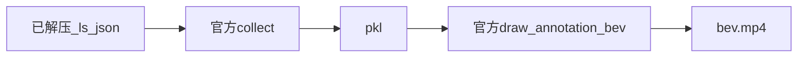
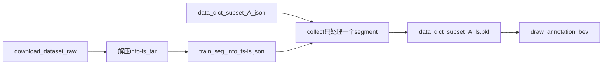

# 生成 BEV 视频

## 可行性

已有数据集`train/00000` 的 32 个 `*-ls.json`、`data_dict_subset_A.json`。

- **新增** `BEV/` 目录下的文件：
  - `BEV/render_bev_video.py`
  - `BEV/filter_driving_behavior.py`：压线/变道行为筛选（步骤 6）
  - `BEV/pyproject.toml`：独立 uv 环境
  - `BEV/.gitignore`：`.venv/`、`.python-version`、`vis/`、`out/`
- 脚本用 `sys.path` 指向仓库根 `import openlanev2`，不 `setup.py develop`、不改官方包。

## 目标

用官方 `collect` + `draw_annotation_bev` 把 `train/00000` 的 lane segment 真值画成 `BEV/vis/bev_00000/bev.mp4`。

在 `BEV/` 用 uv 锁定官方 Python 3.8 + 仓库根 `requirements.txt` pin。**不改**根目录 `pyproject.toml`。



---

## 实施文件

| 路径 | 作用 |
|------|------|
| `BEV/pyproject.toml` | 官方 3.8 + requirements pin + openxlab |
| `BEV/render_bev_video.py` | `--prepare-data` / `--preprocess` / 渲染；`--split/--segment all`、`--no-png`、`--no-ego`、`--ego-size`、`--line-width` |
| `BEV/filter_driving_behavior.py` | 压线（online）/完整变道（lanechange）行为筛选，判定对齐 `prompts/`，产出 `BEV/out/` |
| `BEV/.gitignore` | `.venv/`、`.python-version`、`vis/`、`out/` |

在 `BEV/` 执行 `uv python pin 3.8` 与 `uv sync`。 `--prepare-data` 解压info-ls。

---

## 步骤 1：环境

### `BEV/pyproject.toml`

对应官方 Python 3.8 + `requirements.txt`。**不**改根目录 pyproject，**不** `setup.py develop`。脚本自行把仓库根加入 `sys.path`。

```toml
[project]
name = "openlanev2-bev"
version = "0.1.0"
description = "OpenLane-V2 BEV video helpers"
readme = "BEV.md"
requires-python = ">=3.8,<3.9"
dependencies = [
    "openxlab>=0.1.3",
    "tqdm",
    "ninja",
    "jupyter",
    "openmim",
    "matplotlib>=3.3,<3.8",
    "numpy>=1.22.0,<1.24.0",
    "scikit-learn",
    "similaritymeasures",
    "opencv-python",
    "scipy==1.8.0",
    "iso3166",
    "chardet",
    "shapely==2.0.0",
]

[tool.uv]
exclude-newer = "2024-06-01T00:00:00Z"
exclude-newer-package = { openmim = false, openxlab = false, cycler = false }
environments = ["sys_platform == 'win32'"]
```

```bash
cd BEV
uv python pin 3.8
uv sync
uv run python render_bev_video.py --help
```


`BEV/.gitignore`：

```
.venv/
.python-version
vis/
```

---

## 步骤 2：数据处理

数据要经过：校验已解压的 `*-ls.json` → `collect` 只处理一个 segment → 生成 pkl → `draw_annotation_bev`。



### 2.1 解压 info-ls

`--prepare-data` 解压`tar -xf ... -C data/OpenLane-V2`：

- `data/OpenLane-V2/{train,val,test}` 在（train 700 / val 150 / test 150 段）
- `data/OpenLane-V2/train/00000/info/` 有 **32** 个 `*-ls.json`，与 `data_dict_subset_A.json` 里 `train/00000` 的 32 个 timestamp **一一对应**
- `data_dict_subset_A.json` 仍在 `data/OpenLane-V2/`
- **已生成** `data/OpenLane-V2/data_dict_subset_A_ls.pkl`（单段）、`data/OpenLane-V2/data_dict_subset_A_online_ls.pkl`（online 2,809 帧）与 `data/OpenLane-V2/data_dict_subset_A_lanechange_ls.pkl`（lanechange 393 帧）
- `data/OpenLane-V2/train/00000/image` **没有**（暂时不需要相机图）

### 2.1b 解压前的 OpenXLab 原始布局

```
download_dataset/OpenDriveLab___OpenLane-V2/raw/
  OpenLane-V2_subset_A_info/          已解压：train/val/test，仅 {timestamp}.json
  OpenLane-V2_subset_A_info-ls/OpenLane-V2_subset_A_info-ls
                                     无后缀 ustar（约 1GB，文件头 test/）
  OpenLane-V2_subset_A_image_0/       已解压：仅 train/00000–00099 图像
```

仓库内已有清单：`data/OpenLane-V2/data_dict_subset_A.json`（被 gitignore 例外保留）。

| 文件 | 本计划 | 现状 |
|------|--------|------|
| `*-ls.json` | 必需 | **已解压**到 `data/OpenLane-V2/` |
| `{ts}.json` 中心线 | 不用 | 在 download 的 info 包里，不能替代 `-ls` |
| `data_dict_subset_A.json` | 必需 | 已在 `data/OpenLane-V2/` |
| 相机图 | 不需要 | 可不拷贝 |

官方 `collect()`（`openlanev2/lanesegment/preprocessing/collect.py`）读：

```
{root}/{split}/{segment_id}/info/{timestamp}-ls.json
```

`timestamp` 来自 data_dict 里的文件名去掉 `.json`。不要把 `--root` 指到 `download_dataset` 根目录。

### 2.2 解压 Map Element Bucket（info-ls）

目标 root 固定为 `data/OpenLane-V2/`，与 `data/README.md` hierarchy 一致。tar 顶层就是 `train/` `val/` `test/`，解到该目录即可，不要多套一层。

用户已执行过：

```bash
tar -xf download_dataset/OpenDriveLab___OpenLane-V2/raw/OpenLane-V2_subset_A_info-ls/OpenLane-V2_subset_A_info-ls -C data/OpenLane-V2
```

脚本里用 `tarfile` 做幂等解压（已有 `*-ls.json` 则跳过）：

```python
INFO_LS_TAR = (
    "download_dataset/OpenDriveLab___OpenLane-V2/raw/"
    "OpenLane-V2_subset_A_info-ls/OpenLane-V2_subset_A_info-ls"
)

def prepare_data(tar_path, dest_root, split="train", segment="00000"):
    dest = Path(dest_root)
    dest.mkdir(parents=True, exist_ok=True)
    marker = dest / split / segment / "info"
    if any(marker.glob("*-ls.json")):
        print(f"已存在 {marker}/*-ls.json，跳过解压")
        return
    import tarfile
    print(f"解压 {tar_path} -> {dest}（约 1GB，需数分钟）")
    with tarfile.open(tar_path, "r") as tf:
        tf.extractall(dest)
    if not any(marker.glob("*-ls.json")):
        raise FileNotFoundError(
            f"解压后仍无 {marker}/*-ls.json，检查 tar 是否完整"
        )
```

解压后期望：

```
data/OpenLane-V2/
  data_dict_subset_A.json
  train/00000/info/3159...-ls.json
  val/...
  test/...
```

只认 `-ls.json`。不拷贝中心线 info 包，不拷贝 `image_0`。

### 2.3 collect：只处理一个 segment

禁止对 `data_dict_subset_A.json` 全集跑 `data/OpenLane-V2/preprocess-ls.py`。脚本 `--preprocess --only-segment` 只切出 `train/00000`：

```python
data_dict = io.json_load(f"{root}/{data_dict_name}")
data_dict = {split: {segment: data_dict[split][segment]}}
collect(
    root,
    data_dict,
    collection,  # data_dict_subset_A_ls
    n_points={
        "area": 20,
        "centerline": 10,
        "left_laneline": 20,
        "right_laneline": 20,
    },
)
```

`collect` 会：读每帧 `-ls.json`、pose/内外参转 numpy、车道/区域插值、写出 `{root}/{collection}.pkl`。缺 `-ls.json` 会在这一步失败。

默认参数：

- `--root data/OpenLane-V2`
- `--data-dict data_dict_subset_A.json`
- `--collection data_dict_subset_A_ls`
- `--segment 00000`

### 2.4 校验清单（prepare 结束必须打印）

- `data/OpenLane-V2/train/00000/info` 下至少 1 个 `*-ls.json`
- `data/OpenLane-V2/data_dict_subset_A.json` 存在
- `--preprocess` 后存在 `data/OpenLane-V2/data_dict_subset_A_ls.pkl`
- pkl 体积合理（单段通常远小于全集）

### 2.5 一次跑完数据处理 + 渲染

```bash
cd BEV
uv run python render_bev_video.py --prepare-data --preprocess --only-segment
```

`--prepare-data` 只解压并校验；`--preprocess` 生成 pkl；随后默认渲染 `train/00000`。

---

## 步骤 3：`BEV/render_bev_video.py`（不改官方源码）

文件开头把仓库根加入 `sys.path`：

```python
REPO_ROOT = Path(__file__).resolve().parents[1]
if str(REPO_ROOT) not in sys.path:
    sys.path.insert(0, str(REPO_ROOT))
```

默认 `--root` 用 `REPO_ROOT / "data/OpenLane-V2"`，`--info-ls-tar` 相对仓库根。

对齐 `tutorials/LaneSegment.ipynb` 与 `openlanev2/lanesegment/visualization/bev.py`。

启动渲染时打印：`官方 collect / draw_annotation_bev，CPU 绘制标注 BEV。`

完整脚本：

```python
import argparse
import shutil
import sys
import tarfile
from pathlib import Path

REPO_ROOT = Path(__file__).resolve().parents[1]
if str(REPO_ROOT) not in sys.path:
    sys.path.insert(0, str(REPO_ROOT))

import cv2
import numpy as np

from openlanev2.lanesegment.dataset import Collection
from openlanev2.lanesegment.io import io
from openlanev2.lanesegment.preprocessing import collect
from openlanev2.lanesegment.visualization import (
    assign_attribute,
    draw_annotation_bev,
)
from openlanev2.lanesegment.visualization.bev import BEV_SCALE, BEV_RANGE
import openlanev2.lanesegment.visualization.bev as ls_bev
import openlanev2.centerline.visualization.bev as cl_bev

N_POINTS = {
    "area": 20,
    "centerline": 10,
    "left_laneline": 20,
    "right_laneline": 20,
}

# nuPlan Pacifica 自车参数（米）：后轴→车尾 / 后轴→车头 / 车宽。
# 标注为 Ego 坐标系、原点=后轴中心（nuPlan 惯例）。
PACIFICA = (1.127, 4.049, 2.297)


def _ego_to_col(y_ego):
    # 与官方 _draw_line 相同：左为正 y，像素列向小
    return int(round(BEV_SCALE * (BEV_RANGE[3] - y_ego)))


def _ego_to_row(x_ego):
    # 前为正 x，像素行向小（车头朝上）
    return int(round(BEV_SCALE * (BEV_RANGE[1] - x_ego)))


def draw_ego_vehicle(image, rear=PACIFICA[0], front=PACIFICA[1], width=PACIFICA[2]):
    """在标注 BEV 图上叠加自车框。官方 draw_annotation_bev 不画自车，故在此补画。"""
    half = width / 2
    pt1 = (_ego_to_col(half), _ego_to_row(front))
    pt2 = (_ego_to_col(-half), _ego_to_row(-rear))
    cv2.rectangle(image, pt1, pt2, (255, 0, 0), -1)
    cv2.rectangle(image, pt1, pt2, (0, 0, 0), 2)
    cv2.arrowedLine(
        image,
        (_ego_to_col(0), _ego_to_row((front - rear) / 2)),
        (_ego_to_col(0), _ego_to_row(front - 0.1)),
        (255, 255, 255),
        2,
        tipLength=0.3,
    )


def _draw_line_fast(image, line, with_attribute, with_linetype):
    """官方 _draw_line 的等价快速实现：一次 cv2.polylines 替代 999 次 cv2.line。

    官方实现（openlanev2/lanesegment/visualization/bev.py:33）把每条折线
    interp_arc 重采样到 1000 点后逐段 cv2.line，每帧约 25 万次调用；
    本函数逐点取整方式与官方一致（int 截断 + 偏移），仅合并绘制调用。
    运行时 patch 到 ls_bev._draw_line，不改官方源码。
    """
    points = np.array(line["points"])
    points = BEV_SCALE * (-points[:, :2] + np.array([BEV_RANGE[1], BEV_RANGE[3]]))
    points = ls_bev.interp_arc(points)
    if points is None:
        return

    if with_attribute and len(set(line["attributes"]) - set([0])):
        colors = [ls_bev.COLOR_DICT[a] for a in set(line["attributes"]) - set([0])]
    elif with_linetype and line["linetype"]:
        colors = [ls_bev.COLOR_DICT[line["linetype"]]]
    else:
        colors = [ls_bev.COLOR_DEFAULT]

    thickness = ls_bev.THICKNESS
    for idx, color in enumerate(colors):
        pts = (points + idx * thickness * 1.5).astype(np.int32)
        pts = np.stack([pts[:, 1], pts[:, 0]], axis=1)
        cv2.polylines(image, [pts], False, color=color,
                      thickness=thickness, lineType=cv2.LINE_AA)


def prepare_data(tar_path, dest_root, split="train", segment="00000"):
    dest = Path(dest_root)
    dest.mkdir(parents=True, exist_ok=True)
    marker = dest / split / segment / "info"
    if any(marker.glob("*-ls.json")):
        print(f"已存在 {marker}/*-ls.json，跳过解压")
        return
    print(f"解压 {tar_path} -> {dest}（约 1GB，需数分钟）")
    with tarfile.open(tar_path, "r") as tf:
        tf.extractall(dest)
    if not any(marker.glob("*-ls.json")):
        raise FileNotFoundError(
            f"解压后仍无 {marker}/*-ls.json，检查 tar 是否完整"
        )


def parse_args():
    parser = argparse.ArgumentParser(description="Render OpenLane-V2 BEV video")
    parser.add_argument("--root", default=str(REPO_ROOT / "data/OpenLane-V2"))
    parser.add_argument("--data-dict", default="data_dict_subset_A.json")
    parser.add_argument("--collection", default="data_dict_subset_A_ls")
    parser.add_argument("--split", default="train")
    parser.add_argument("--segment", default="00000")
    parser.add_argument("--out-dir", default=None)
    parser.add_argument("--fps", type=int, default=10)
    parser.add_argument(
        "--line-width",
        type=int,
        default=2,
        help="线宽（官方 THICKNESS=4，覆盖为运行时 patch，不改官方源码）",
    )
    parser.add_argument("--preprocess", action="store_true")
    parser.add_argument("--only-segment", action="store_true")
    parser.add_argument("--prepare-data", action="store_true")
    parser.add_argument("--no-png", action="store_true", help="只写视频,不导出逐帧 png")
    parser.add_argument("--per-segment", action="store_true",
                        help="按 segment 拆分输出到 <out-dir>/<segment>/bev.mp4(配合 --segment all)")
    parser.add_argument("--copy-images", action="store_true",
                        help="把命中帧对应的相机图复制到段文件夹,命名 <segment>_image_<camera>_<timestamp>.jpg")
    parser.add_argument(
        "--image-root",
        default=str(
            REPO_ROOT
            / "download_dataset/OpenDriveLab___OpenLane-V2/raw/"
            / "OpenLane-V2_subset_A_image_0"
        ),
    )
    parser.add_argument(
        "--cameras",
        nargs="*",
        default=["ring_front_center"],
        help="要复制的相机目录名;传 all 表示该段全部相机",
    )
    parser.add_argument("--no-fast-lines", dest="fast_lines", action="store_false",
                        help="关闭 cv2.polylines 快速绘制,回退官方逐段 cv2.line")
    parser.add_argument("--with-ego", dest="with_ego", action="store_true", default=True)
    parser.add_argument("--no-ego", dest="with_ego", action="store_false")
    parser.add_argument(
        "--ego-size",
        nargs=3,
        type=float,
        metavar=("REAR", "FRONT", "WIDTH"),
        default=list(PACIFICA),
        help="自车尺寸（米）：后轴到车尾、后轴到车头、车宽",
    )
    parser.add_argument(
        "--info-ls-tar",
        default=str(
            REPO_ROOT
            / "download_dataset/OpenDriveLab___OpenLane-V2/raw/"
            / "OpenLane-V2_subset_A_info-ls/OpenLane-V2_subset_A_info-ls"
        ),
    )
    return parser.parse_args()


def run_preprocess(root, data_dict_name, collection, split, segment, only_segment):
    dict_path = Path(root) / data_dict_name  # pathlib 对绝对路径自动覆盖
    if not dict_path.exists():
        dict_path = Path(data_dict_name)  # 尝试按当前工作目录解析
    data_dict = io.json_load(str(dict_path))
    if only_segment:
        if split not in data_dict or segment not in data_dict[split]:
            avail = ", ".join(
                f"{sp}/{sg}" for sp, segs in data_dict.items()
                for sg in list(segs)[:2])
            raise KeyError(
                f"{data_dict_name} 中没有 {split}/{segment}；"
                f"该文件包含的段示例: {avail}（共 "
                f"{sum(len(v) for v in data_dict.values())} 段）")
        data_dict = {split: {segment: data_dict[split][segment]}}
    collect(root, data_dict, collection, n_points=N_POINTS)
    print(f"已生成 {root}/{collection}.pkl")


def render_frame_bgr(frame, with_ego, ego_size):
    ann = frame.get_annotations()
    if ann is None:
        return None
    ann = assign_attribute(ann)
    bev = draw_annotation_bev(
        ann,
        with_attribute=False,
        with_linetype=True,
        with_centerline=True,
        with_laneline=True,
        with_area=False,
    )
    if with_ego:
        draw_ego_vehicle(bev, *ego_size)
    bev = np.clip(bev, 0, 255).astype(np.uint8)
    return cv2.cvtColor(bev, cv2.COLOR_RGB2BGR)


def copy_segment_images(image_root, split, segment, timestamps, dst_dir, cameras):
    """把命中帧的相机图复制为 <segment>_image_<camera>_<timestamp>.jpg。"""
    src_base = Path(image_root) / split / segment / "image"
    if not src_base.is_dir():
        return 0, 0  # 该 split/段本就没有相机图（val/test），不计缺失
    if cameras == ["all"]:
        cams = sorted(p.name for p in src_base.iterdir() if p.is_dir())
    else:
        cams = list(cameras)
    copied = missing = 0
    for ts in timestamps:
        for cam in cams:
            src = src_base / cam / f"{ts}.jpg"
            if src.is_file():
                shutil.copy2(src, dst_dir / f"{segment}_image_{cam}_{ts}.jpg")
                copied += 1
            else:
                missing += 1
    return copied, missing


def render_segment(root, collection, split, segment, out_dir, fps, with_ego=True,
                   ego_size=PACIFICA, no_png=False, per_segment=False,
                   copy_images=False, image_root=None, cameras=("ring_front_center",)):
    print("官方 collect / draw_annotation_bev，CPU 绘制标注 BEV。")
    dataset = Collection(root, root, collection)
    frames = []
    for i in range(len(dataset.keys)):
        identifier, frame = dataset.get_frame_via_index(i)
        if split not in ("all", identifier[0]):
            continue
        if segment not in ("all", identifier[1]):
            continue
        frames.append((identifier, frame))
    frames.sort(key=lambda item: (item[0][0], item[0][1], int(item[0][2])))
    if not frames:
        raise RuntimeError(
            f"pkl 中没有 {split}/{segment}。先加 --preprocess，或检查 --collection/--segment"
        )

    out_dir = Path(out_dir)
    groups = {}
    for item in frames:
        key = (item[0][0], item[0][1]) if per_segment else None
        groups.setdefault(key, []).append(item)

    total_written = 0
    for key, group in groups.items():
        if per_segment:
            gsplit, gseg = key
            sub_dir = out_dir / gseg
        else:
            gsplit = gseg = None
            sub_dir = out_dir
        sub_dir.mkdir(parents=True, exist_ok=True)
        writer = None
        written = 0
        timestamps = []

        for i, (identifier, frame) in enumerate(group):
            bgr = render_frame_bgr(frame, with_ego, ego_size)
            if bgr is None:
                print(f"跳过无标注帧 {identifier}")
                continue
            if not no_png:
                cv2.imwrite(str(sub_dir / f"{i:06d}.png"), bgr)
            if writer is None:
                height, width = bgr.shape[:2]
                writer = cv2.VideoWriter(
                    str(sub_dir / "bev.mp4"),
                    cv2.VideoWriter_fourcc(*"mp4v"),
                    fps,
                    (width, height),
                )
            writer.write(bgr)
            written += 1
            timestamps.append(identifier[2])
            if not per_segment:
                print(identifier)

        if writer is not None:
            writer.release()
        total_written += written
        if per_segment:
            print(f"{gsplit}/{gseg}: {written} 帧 -> {sub_dir / 'bev.mp4'}", flush=True)
            if copy_images:
                copied, missing = copy_segment_images(
                    image_root, gsplit, gseg, timestamps, sub_dir, list(cameras))
                if copied or missing:
                    print(f"  相机图: 复制 {copied} 张, 缺失 {missing} 张", flush=True)

    if total_written == 0:
        raise RuntimeError("没有写出任何帧（可能全是 test 无标注）")
    if per_segment:
        print(f"完成 {total_written} 帧、{len(groups)} 段 -> {out_dir}")
    else:
        print(f"完成 {total_written} 帧 -> {out_dir / 'bev.mp4'}")


def main():
    args = parse_args()
    ls_bev.THICKNESS = args.line_width
    cl_bev.THICKNESS = args.line_width
    if args.fast_lines:
        ls_bev._draw_line = _draw_line_fast
    out_dir = args.out_dir or str(
        Path(__file__).resolve().parent / "vis" / f"bev_{args.segment}"
    )
    if args.prepare_data:
        prepare_data(args.info_ls_tar, args.root, args.split, args.segment)
    if args.preprocess:
        run_preprocess(
            args.root,
            args.data_dict,
            args.collection,
            args.split,
            args.segment,
            args.only_segment,
        )
    if args.copy_images and not args.per_segment:
        parser_error = "--copy-images 需与 --per-segment 同用"
        raise SystemExit(parser_error)
    render_segment(
        args.root,
        args.collection,
        args.split,
        args.segment,
        out_dir,
        args.fps,
        args.with_ego,
        tuple(args.ego_size),
        args.no_png,
        args.per_segment,
        args.copy_images,
        args.image_root,
        tuple(args.cameras),
    )


if __name__ == "__main__":
    main()
```

画布 1000x500，官方 `BEV_SCALE=10`、`BEV_RANGE=[-50,50,-25,25]`。

### 自车叠加（后补，2026-09）

官方 `draw_annotation_bev` 只画 lane_segment 与 area（`bev.py:78-89`），整个官方可视化模块没有自车绘制参数，因此自车在 `BEV/render_bev_video.py` 内补画（不动官方源码，上面的脚本清单以实际文件为准）：

- 标注为 Ego 坐标系、原点=后轴中心（nuPlan 惯例）；像素映射与官方 `_draw_line` 一致：`col=10×(25−y)`、`row=10×(50−x)`，车头朝上
- 车型 nuPlan Pacifica：后轴→车尾 1.127 m、后轴→车头 4.049 m、宽 2.297 m（`PACIFICA` 常量）
- `draw_ego_vehicle()`：红色实心矩形 + 黑描边 + 白色前向箭头，在 `np.clip` 前叠加
- CLI：`--no-ego` 关闭；`--ego-size REAR FRONT WIDTH`（米）覆盖默认尺寸

### 线宽与颜色图例（后补，2026-09）

- 线宽：官方 `THICKNESS=4`（`openlanev2/centerline/visualization/utils.py:26`）。脚本在 `main()` 里对 `ls_bev.THICKNESS` / `cl_bev.THICKNESS` 做运行时 patch（默认 2，`--line-width` 可调），不改官方源码。
- 绘制提速（2026-09）：官方 `_draw_line` 把每条折线 `interp_arc` 重采样到 1000 点后逐段 `cv2.line`，每帧约 25 万次调用、~1.4 s/帧。脚本用 `_draw_line_fast`（一次 `cv2.polylines` 替代）运行时 patch `ls_bev._draw_line`，**逐像素 0 差异**，32 帧渲染 37.1s→4.3s（8.6×），全量行为视频 9083 帧 2h21m→12m。`--no-fast-lines` 可回退官方实现。
- 颜色映射 `COLOR_DICT`（`utils.py:29-43`），三类元素共用。当前渲染默认：**`with_attribute=False`、`with_linetype=True`、`with_area=False`**（`with_centerline/with_laneline` 仍为 True）：
  - **中心线**：默认 `with_attribute=False` → 统一蓝色（COLOR_DEFAULT）；若开启 `with_attribute=True` 则按该车道的红绿灯属性着色（`assign_attribute` 从 `topology_lste` 关联）——红=红灯、绿=绿灯、黄=黄灯（attribute 1/2/3）。中心线首尾蓝点为端点顶点标记（`_draw_vertex`）
  - **车道边线**（默认着色来源）：`left/right_laneline_type`（`data/README.md:200-202`）——蓝=0 none、红=1 solid 实线、绿=2 dash 虚线
  - **区域**：默认 `with_area=False` 不绘制；若开启则按 `category`（`data/README.md:239-240`）着色——红=1 pedestrian_crossing 人行横道、绿=2 road_boundary 道路边界

---

## 步骤 4：操作步骤

1. `cd BEV` 后 `uv python pin 3.8` + `uv sync`
2. `uv run python render_bev_video.py --prepare-data --preprocess --only-segment` → `BEV/vis/bev_00000/bev.mp4`
3. `uv run python filter_driving_behavior.py --sample-vis 3` → `BEV/out/`（online/lanechange 两套 events csv + data_dict json + 抽样图）
4. 行为帧视频（pkl 已存在时去掉 `--preprocess` 可跳过 collect；online 2,809 帧约 8 分钟、lanechange 393 帧约 2 分钟）：
   `uv run python render_bev_video.py --data-dict out/data_dict_subset_A_online.json --collection data_dict_subset_A_online_ls --preprocess --split all --segment all --out-dir vis/bev_behavior/online --no-png --per-segment --copy-images`（lanechange 同理换 json/collection/out-dir）
5. 常见错误：`--root` 指错、对全集 collect、误用系统高版本 Python

---

## 步骤 5：验收（2026-09 已全部通过）

```bash
cd BEV
uv python pin 3.8
uv sync
uv run python render_bev_video.py --help
uv run python render_bev_video.py --prepare-data --preprocess --only-segment
uv run python filter_driving_behavior.py --sample-vis 3
```

> `--sample-vis N`：为 online/lanechange 各渲染 N 张抽样验证图到 `out/vis/`；不影响事件判定与 CSV/JSON 产出（脚本代码默认 4，本文档统一用 3）。

- `BEV/vis/bev_00000/bev.mp4`：32 帧，含自车框 ✓
- `BEV/out/online_events.csv`：470 压线时段（27,283 帧中） ✓
- `BEV/out/lanechange_events.csv`：71 次完整变道（含 00012/00094 截断穿越型与 00051 双黄线穿越） ✓
- `BEV/vis/bev_behavior/online/<segment>/`：332 段、2,809 帧 + 249 张相机图 ✓
- `BEV/vis/bev_behavior/lanechange/<segment>/`：71 段、393 帧 + 44 张相机图 ✓

---

## 步骤 6：压线（online）/ 变道（lanechange）行为筛选（`BEV/filter_driving_behavior.py`）

判定逻辑对齐 `prompts/online_prompt.md` 与 `prompts/lanechange_prompt.md`（2026-09 按 prompt 重写）。在 `BEV/` 下运行（无新依赖）：

```bash
uv run python filter_driving_behavior.py --sample-vis 3
```

- **数据源**：直接读 `data_dict_subset_A.json` 的 train+val 全部 `-ls.json`（test 无标注，不参与）
- **物理线合并**（2026-09 审查修复）：一条物理边线常被切成多块（相邻段接缝、A.right==B.left 共享边界）。收集各非 ic 段边线的全局几何、按端点匹配（tol 0.3m）拼成物理线用于分组。**拼接要求接缝处行进方向一致（夹角<60°）**，避免路口节点处误接垂直相交的其它道路线（00094 曾出现 d=+36~+93 垃圾值）；分叉处多候选同时匹配时取方向余弦最大者
- **d 逐帧用当前帧标注直接计算**（00051 漏检修复）：`-ls.json` 里的 laneline 点已是该帧 ego 系坐标，且**按每帧 ±50m 视野截断**。若只存线首次出现帧的全局几何再回投各帧，车开出去后存量线的前向端落在窗口外，d 大面积丢失（00051 双黄线穿越 f16 后全丢即此因）。现改为：每帧 d 用该帧自身点算，全局几何仅用于合并与成员归属；同一物理线多个碎片同帧出现时取 |d| 最小者
- **压线（online）**：`signed_lateral` 对**与车体纵向窗口 x∈[−1.127, 4.049] 相交的线段**做线性插值求带符号最近距离 d（左正右负，穿过车轴=0）。注意车道线顶点稀疏（间距可达 10m+），只看顶点会大面积漏帧。`|d| ≤ 1.1485`（车半宽）= 线在车体正下方。同一物理线连续压线 **≥2 帧**才算有效时段（prompt：仅一帧蹭线不算）；**非排除帧的单帧数据空洞按两侧 d 线性插值桥接**（两侧异号记 0=洞内完成穿越；路口/斑马线排除帧不桥接）。direction 取时段内 |d|>0.05 帧的多数符号（LEFT/RIGHT），平票取最后一个有效帧符号，全为 0 记 BOTH（严格 BOTH「同时骑跨左右两线」由两个独立事件分别表达）；线型 NONE/SOLID/DASH。**起止时间按实际 timestamp 差计算**（纳秒单位；旧版用帧序号×0.5s，段内缺帧即错位）
- **完整变道（lanechange，两种完成情形）**：
  - **A. 可见穿越**：压线时段前 d>+half、后 d<−half（或反向）= 线完整从车一侧穿越到另一侧（prompt 条件2【越线深度】）；时段允许仅 1 帧（2Hz 下快速变道可只压 1 帧，完整性由前后帧保证）；**before/after 各容忍最多 2 帧数据空洞**（向前/后取最近非 None d，穿越中线恰遇线短暂离开窗口不再漏判），但**遇路口/斑马线排除帧即停**——不得跨路口借 d 拼出假"完整穿越"
  - **B. 截断穿越**（00012/00094 型漏检修复）：线穿越车轴后从标注中消失（碎片结束、跨路口未拼接等）——要求进入侧 |before|>half、时段末 d 已过中心（符号翻转>0.05m）、其后整段视频该线不再压线（允许远距离重现）、非视频末尾，并按 prompt 条件1【车道占有】校验：**时段末+2 帧处**（容忍入道滑行 1-2 帧）的参考段与**回溯到的**起始参考段（车骑线时 ref 可能为 None，向前找最近非 None）不同且无直接纵向前后继关系（`topology_lsls`）
  - 方向：线左→右 = 车 LEFT。段末仍骑线未过中心不判（prompt）。每段只取时间上第一个完整变道
- **路口/人行横道排除**（prompt：路口标线混乱段不判）：① ic 段的线不参与；② 自车参考段在 ic 段内、或车体与 pedestrian_crossing（area category=1）相交的帧，整帧不算压线/变道并打断时段。**参考段与斑马线判定全程在 ego 系**（自车中心/矩形是常量，直接用车道线/区域原始 ego 点，省每帧 ~40 次全局变换；左右线先弧长重采样等长再闭合多边形，防蝴蝶结自交）
- **产出**（`BEV/out/`）：`online_events.csv`、`lanechange_events.csv`（seg_id/侧/线型/方向/起止帧与秒）、`data_dict_subset_A_online.json`、`data_dict_subset_A_lanechange.json`、`vis/` 抽样验证图
- **抽样验证图**（`render_flag_frame`）：`with_attribute=True、with_area=True`（与主视频默认不同），画出人行横道与灯色便于目检
- **全量结果**（train 700 + val 150 段，27,283 帧）：online 470 时段/2,809 帧/332 段；lanechange 71 次完整变道/393 帧/71 段（修复前虚高：online 3,711、lanechange 178；此后逐轮找回 00012/00094/00051 等真变道。第四轮：入道滑行容忍、不跨路口借 d、单帧空洞桥接、方向平票取末帧符号——帧集与上一轮一致，视频未变）。抽样验证段：00012/00051/00094 检出变道（相机图确认），00040 无变道（压线折返，online 记录不判 lanechange）

### 按段拆分输出 + 相机图 + 分文件夹（2026-09）

`render_bev_video.py` 参数：

- `--per-segment`：配合 `--segment all`，每段输出 `<out-dir>/<segment>/bev.mp4`
- `--copy-images`：需与 `--per-segment` 同用。命中帧相机图复制为 `<segment>_image_<camera>_<timestamp>.jpg`（如 `00001_image_ring_front_center_315968876149927216.jpg`），放同段文件夹
- `--image-root`：默认 `download_dataset/OpenDriveLab___OpenLane-V2/raw/OpenLane-V2_subset_A_image_0`（结构 `{split}/{segment}/image/{camera}/{ts}.jpg`）
- `--cameras`：默认仅 `ring_front_center`；`all` 为全部 7 相机
- **注意**：subset_A 只有 `train/00000–00099` 有相机图，val/test 无图（打印缺失数、不报错）

online 与 lanechange 分别渲染到各自文件夹：

```bash
uv run python render_bev_video.py --data-dict out/data_dict_subset_A_online.json --collection data_dict_subset_A_online_ls --preprocess --split all --segment all --out-dir vis/bev_behavior/online --no-png --per-segment --copy-images
uv run python render_bev_video.py --data-dict out/data_dict_subset_A_lanechange.json --collection data_dict_subset_A_lanechange_ls --preprocess --split all --segment all --out-dir vis/bev_behavior/lanechange --no-png --per-segment --copy-images
```

输出结构：`BEV/vis/bev_behavior/online/<segment>/`（332 段、2,809 帧、249 图）与 `BEV/vis/bev_behavior/lanechange/<segment>/`（71 段、393 帧、44 图），如 `lanechange/00051/bev.mp4`、`online/00051/bev.mp4`。

完整脚本（`BEV/filter_driving_behavior.py`，以实际文件为准）：

```python
"""压线（online）/ 变道（lanechange）行为筛选。

判定逻辑对齐 prompts/online_prompt.md 与 prompts/lanechange_prompt.md：
- 压线 = 车道线处于车体正下方：线在车体纵向窗口 x∈[-rear, front] 内的带符号
  横向偏移 |d| <= 车体半宽（d 为 ego 系 y，左正右负；对与窗口相交的线段做
  线性插值求 d，车道线顶点稀疏，只看顶点会大面积漏帧）。
- 每帧 d 用当前帧自身标注的 ego 系点直接计算（标注按每帧 ±50m 视野截断，
  回投存量全局几何会丢数据，00051 双黄线穿越即因此漏检）；全局几何仅用于
  物理线合并（端点匹配 + 接缝方向一致，分叉时取方向最一致候选）。
- 压线时段（online）：同一物理线连续压线 >= 2 帧（一蹭即离不算）；非排除帧的
  单帧数据空洞按两侧线性插值桥接（两侧异号记 0，即穿越发生在洞内）。方向取时段内
  过中心帧之外的多数符号（LEFT/RIGHT），平票取最后一个有效帧符号，全为 0 记 BOTH
  （BOTH 的严格含义"同时骑跨左右两线"由两个独立事件分别表达）；起止时间按实际
  timestamp 差（纳秒）计算（容许段内缺帧）。
- 完整变道（lanechange，两种完成情形）：
  A. 可见穿越：压线时段前 d>+half、后 d<-half（或反向）；before/after 允许
     最多 2 帧数据空洞（向前/后找最近非 None d，但**不跨路口/斑马线排除帧借 d**）。
  B. 截断穿越：线穿越车轴后不再压线（碎片结束、跨路口未拼接等）——要求进入侧
     |before|>half、时段末 d 已过中心、其后不再压线、非视频末尾，且【车道占有】：
     自车参考段（取时段末+2 帧处，容忍入道滑行）与回溯到的起始参考段不同且无
     纵向前后继关系。
  每段只取时间上第一个完整变道。
- 路口/人行横道排除：① ic 段的线不参与；② 自车参考段在 ic 段内（多边形在
  ego 系直接判定，左右线重采样等长后闭合防自交）或车体与 pedestrian_crossing
  相交的帧，整帧不算压线/变道并打断时段。
"""
import argparse
import csv
import json
import sys
from pathlib import Path

REPO_ROOT = Path(__file__).resolve().parents[1]
if str(REPO_ROOT) not in sys.path:
    sys.path.insert(0, str(REPO_ROOT))

import cv2
import numpy as np
from shapely.geometry import Point, Polygon

import openlanev2.lanesegment.visualization.bev as ls_bev
from openlanev2.lanesegment.visualization import assign_attribute, draw_annotation_bev

from render_bev_video import PACIFICA, draw_ego_vehicle

LINETYPE_NAME = {0: "NONE", 1: "SOLID", 2: "DASH"}
FRAME_DT = 0.5  # 标称 2Hz（仅用于时段末尾 +0.5s 的结束偏移）
REAR, FRONT, EGO_WIDTH = PACIFICA
HALF = EGO_WIDTH / 2
EGO_CENTER_X = (FRONT - REAR) / 2  # 自车几何中心在 ego 系的 x


def parse_args():
    parser = argparse.ArgumentParser(
        description="Filter OpenLane-V2 frames with online / lanechange behavior")
    parser.add_argument("--root", default=str(REPO_ROOT / "data/OpenLane-V2"))
    parser.add_argument("--data-dict", default="data_dict_subset_A.json")
    parser.add_argument("--splits", nargs="*", default=["train", "val"])
    parser.add_argument("--out-dir", default=str(Path(__file__).resolve().parent / "out"))
    parser.add_argument("--sample-vis", type=int, default=4, help="每类行为抽样渲染帧数")
    parser.add_argument("--limit-segments", type=int, default=0, help="调试用:每 split 只处理前 N 段")
    return parser.parse_args()


def ego_to_global(pts_xy, translation, rotation):
    return pts_xy @ rotation.T + translation


def ego_footprint_local():
    """自车矩形（ego 系常量）。"""
    return Polygon([(-REAR, -HALF), (-REAR, HALF), (FRONT, HALF), (FRONT, -HALF)])


def load_frame(info_dir, timestamp):
    with open(info_dir / f"{timestamp}-ls.json", "r") as f:
        return json.load(f)


def frame_pose(frame):
    t = np.array(frame["pose"]["translation"], dtype=np.float64)[:2]
    R = np.array(frame["pose"]["rotation"], dtype=np.float64)[:2, :2]
    return t, R


def signed_lateral(pts, rear=REAR, front=FRONT):
    """车道线（折线）相对车体纵轴（ego y=0）在纵向窗口 x∈[-rear, front] 内的
    带符号最近距离。左正右负；线在窗口内穿过纵轴则 0；线完全在窗口外则 None。
    对与窗口相交的线段做线性插值（顶点稀疏，只看顶点会大面积漏帧）。
    """
    e = np.asarray(pts, dtype=np.float64)[:, :2]
    if len(e) < 2:
        return None
    x0, x1 = -rear, front
    ys = []
    for (ax, ay), (bx, by) in zip(e[:-1], e[1:]):
        if ax == bx:
            if not (x0 <= ax <= x1):
                continue
            seg_ys = [ay, by]
        else:
            ta = (x0 - ax) / (bx - ax)
            tb = (x1 - ax) / (bx - ax)
            lo, hi = sorted((ta, tb))
            lo, hi = max(lo, 0.0), min(hi, 1.0)
            if lo > hi:
                continue
            seg_ys = [ay + (by - ay) * lo, ay + (by - ay) * hi]
        if (seg_ys[0] <= 0 <= seg_ys[1]) or (seg_ys[1] <= 0 <= seg_ys[0]):
            return 0.0
        ys.extend(seg_ys)
    if not ys:
        return None
    return float(min(ys, key=abs))


def resample_n(pts, n):
    """折线按弧长重采样到 n 点（左右线等长后闭合多边形才不自交）。"""
    p = np.asarray(pts, dtype=np.float64)[:, :2]
    if len(p) < 2:
        return p
    d = np.linalg.norm(np.diff(p, axis=0), axis=1)
    cum = np.concatenate([[0.0], np.cumsum(d)])
    if cum[-1] <= 0:
        return np.repeat(p[:1], n, axis=0)
    t = np.linspace(0.0, cum[-1], n)
    return np.stack([np.interp(t, cum, p[:, 0]), np.interp(t, cum, p[:, 1])], axis=1)


def reference_segment(segments, center_pt):
    """自车中心（ego 系常量点）落在哪个车道段多边形内（全程 ego 系，不做全局变换）。
    返回 (id, is_intersection_or_connector)。"""
    best_id, best_area, best_ic = None, -1.0, False
    for seg in segments:
        left = resample_n(seg["left_laneline"], 20)
        right = resample_n(seg["right_laneline"], 20)
        if len(left) < 2 or len(right) < 2:
            continue
        poly = Polygon(np.concatenate([left, right[::-1]]))
        if not poly.is_valid:
            poly = poly.buffer(0)
        if poly.covers(center_pt) and poly.area > best_area:
            best_id, best_area = seg["id"], poly.area
            best_ic = bool(seg.get("is_intersection_or_connector", False))
    return best_id, best_ic


def in_crosswalk(footprint_ego, areas):
    """自车矩形与任何 pedestrian_crossing（category=1，ego 系）相交。"""
    for area in areas:
        if area.get("category", 0) != 1:
            continue
        pts = np.array(area["points"], dtype=np.float64)[:, :2]
        if len(pts) < 3:
            continue
        poly = Polygon(pts)
        if not poly.is_valid:
            poly = poly.buffer(0)
        if footprint_ego.intersects(poly):
            return True
    return False


def merge_pieces(pieces, tol=0.3):
    """把 (seg_id, side)->(全局折线, linetype) 的碎片按端点匹配拼成物理线。

    同一条物理边线常被切成多块（相邻段接缝、A.right==B.left 共享边界）。
    拼接要求接缝处行进方向一致（夹角<60°），避免路口节点误接垂直线；
    分叉处多个候选同时满足端点匹配时，取方向最一致（余弦最大）者。
    """
    unused = {k: [v[0], v[1]] for k, v in pieces.items()}
    chains = []

    def near(a, b):
        return abs(a[0] - b[0]) < tol and abs(a[1] - b[1]) < tol

    def fwd(p, i, step):
        j = i + step
        if j < 0 or j >= len(p):
            j = i - step
        return p[j] - p[i]

    def cos_dir(v1, v2):
        n1, n2 = np.linalg.norm(v1), np.linalg.norm(v2)
        if n1 == 0 or n2 == 0:
            return 1.0
        return float(np.dot(v1, v2) / (n1 * n2))

    while unused:
        key = next(iter(unused))
        pts, lt = unused.pop(key)
        members = {key}
        changed = True
        while changed:
            changed = False
            best = None  # (cos, k2, mode)
            for k2, (p2, _lt2) in unused.items():
                cands = []
                if near(pts[-1], p2[0]):
                    cands.append((cos_dir(fwd(pts, len(pts) - 1, -1), fwd(p2, 0, 1)), 0))
                if near(pts[-1], p2[-1]):
                    cands.append((cos_dir(fwd(pts, len(pts) - 1, -1), fwd(p2, len(p2) - 1, -1)), 1))
                if near(pts[0], p2[-1]):
                    cands.append((cos_dir(fwd(p2, len(p2) - 1, -1), fwd(pts, 0, 1)), 2))
                if near(pts[0], p2[0]):
                    cands.append((cos_dir(fwd(p2, 0, 1), fwd(pts, 0, 1)), 3))
                for c, mode in cands:
                    if c > 0.5 and (best is None or c > best[0]):
                        best = (c, k2, mode)
            if best:
                _, k2, mode = best
                p2 = unused.pop(k2)[0]
                members.add(k2)
                if mode == 0:
                    pts = np.vstack([pts, p2[1:]])
                elif mode == 1:
                    pts = np.vstack([pts, p2[::-1][1:]])
                elif mode == 2:
                    pts = np.vstack([p2[:-1], pts])
                else:
                    pts = np.vstack([p2[::-1][:-1], pts])
                changed = True
        chains.append((key, pts, lt, members))
    return chains


def longitudinal_pairs(segments, topology_lsls):
    """topology_lsls[i][j]==1 的 (id_i, id_j) 纵向前后继集合。"""
    topo = np.array(topology_lsls, dtype=np.int8)
    ids = [s["id"] for s in segments]
    pairs = set()
    rows, cols = np.nonzero(topo)
    for i, j in zip(rows, cols):
        if i != j:
            pairs.add((ids[i], ids[j]))
    return pairs


def scan_segment(root, split, segment, timestamps):
    """逐帧收集 d（当前帧 ego 点直算）与全局线碎片；合并物理线。
    返回 (frames, series)：frames[i]=(ts, excluded, ref_id, pairs)；
    series[物理线label]=[(frame_idx, d|None, linetype), ...]（每帧都有条目）。"""
    info_dir = Path(root) / split / segment / "info"
    half = HALF
    frames = []
    per_frame_d = []
    pieces = {}
    footprint_ego = ego_footprint_local()
    center_ego = Point(EGO_CENTER_X, 0.0)
    for ts in sorted(timestamps, key=lambda x: int(x.split(".")[0])):
        ts = ts.split(".")[0]
        excluded = True
        ref_id = None
        pairs = set()
        dmap = {}
        frame = load_frame(info_dir, ts)
        if "annotation" in frame and frame["annotation"]:
            annotation = frame["annotation"]
            segments = annotation["lane_segment"]
            t, R = frame_pose(frame)
            ref_id, ref_in_ic = reference_segment(segments, center_ego)
            excluded = ref_in_ic or in_crosswalk(
                footprint_ego, annotation.get("area", []))
            if not excluded:
                pairs = longitudinal_pairs(segments, annotation["topology_lsls"])
            for seg in segments:
                if seg.get("is_intersection_or_connector", False):
                    continue
                for side in ("left", "right"):
                    key = (seg["id"], side)
                    pts = np.array(seg[f"{side}_laneline"],
                                   dtype=np.float64)[:, :2]
                    if len(pts) >= 2 and key not in pieces:
                        pieces[key] = (ego_to_global(pts, t, R),
                                       seg[f"{side}_laneline_type"])
                    if excluded:
                        continue
                    d = signed_lateral(pts)
                    if d is not None:
                        dmap[key] = (d, seg[f"{side}_laneline_type"])
        frames.append((ts, excluded, ref_id, pairs))
        per_frame_d.append(dmap)

    series = {}
    for label, _pts, _lt, members in merge_pieces(pieces):
        seq = []
        for idx in range(len(frames)):
            exc = bool(frames[idx][1])
            best = None
            if not exc:
                for k in members:
                    if k in per_frame_d[idx]:
                        d, lt = per_frame_d[idx][k]
                        if best is None or abs(d) < abs(best[0]):
                            best = (d, lt)
            seq.append((idx, best[0] if best else None,
                        best[1] if best else None, exc))
        series[label] = _bridge_gaps(seq, half)
    return frames, series


def _bridge_gaps(seq, half):
    """桥接**非排除帧**的单帧数据空洞：两侧都压线而中间一帧该线恰好没有数据
    （顶点稀疏/截断边缘）时，按两侧 d 线性插值补上（两侧异号则记 0，即穿越）。
    排除帧（路口/斑马线）不桥接——那是真实的时段打断。"""
    out = [list(e) for e in seq]
    for i in range(1, len(out) - 1):
        if out[i][1] is not None or out[i][3]:
            continue
        _p, pd, plt, pexc = out[i - 1]
        _n, nd, nlt, nexc = out[i + 1]
        if pexc or nexc or pd is None or nd is None:
            continue
        if abs(pd) > half or abs(nd) > half:
            continue
        d = 0.0 if pd * nd < 0 else (pd + nd) / 2.0
        out[i][1] = d
        out[i][2] = plt if plt is not None else nlt
    return [tuple(e) for e in out]


def _nearest_d(seq, pos, step, max_gap):
    """从 pos 起沿 step 方向在 max_gap 帧内找最近非 None 的 d（容忍数据空洞）。
    遇到排除帧（路口/斑马线）立即停止——不得跨路口借 d 拼"完整穿越"。"""
    for k in range(max_gap + 1):
        i = pos + step * k
        if i < 0 or i >= len(seq):
            return None
        _idx, d, _lt, exc = seq[i]
        if exc:
            return None
        if d is not None:
            return d
    return None


def _event_times(frames, start_idx, end_idx):
    # OpenLane-V2 timestamp 单位为纳秒（相邻帧差 5e8 = 0.5s）
    t0 = int(frames[0][0])
    return (round((int(frames[start_idx][0]) - t0) / 1e9, 1),
            round((int(frames[end_idx][0]) - t0) / 1e9 + FRAME_DT, 1))


def merge_events(events):
    """相邻碎片链对同一次物理压线重复计事件时，合并方向与线型相同且帧区间
    重叠/相接的事件。"""
    merged = []
    for e in sorted(events, key=lambda x: (x["start_idx"], x["end_idx"])):
        if merged and e["direction"] == merged[-1]["direction"] \
                and e["line_type"] == merged[-1]["line_type"] \
                and e["start_idx"] <= merged[-1]["end_idx"] + 1:
            prev = merged[-1]
            prev["end_idx"] = max(prev["end_idx"], e["end_idx"])
            prev["end_ts"] = e["end_ts"] if e["end_idx"] >= prev["end_idx"] else prev["end_ts"]
            prev["n_frames"] = max(prev["n_frames"], e["n_frames"],
                                   prev["end_idx"] - prev["start_idx"] + 1)
        else:
            merged.append(dict(e))
    return merged


def _mk_event(frames, run, seg_id, side, direction=None):
    start_idx, end_idx = run[0][0], run[-1][0]
    linetypes = {LINETYPE_NAME[lt] for _, _, lt in run if lt is not None}
    if direction is None:
        signs = [1 if d > 0 else -1 for _, d, _ in run if d is not None and abs(d) > 0.05]
        s = sum(signs)
        if not signs:
            direction = "BOTH"
        elif s > 0:
            direction = "LEFT"
        elif s < 0:
            direction = "RIGHT"
        else:
            # 平票（左右帧数相等）：取时段内最后一个有效帧的符号
            direction = "LEFT" if signs[-1] > 0 else "RIGHT"
    start_time_s, end_time_s = _event_times(frames, start_idx, end_idx)
    return {
        "seg_id": seg_id,
        "side": side,
        "line_type": "/".join(sorted(linetypes)),
        "direction": direction,
        "start_idx": start_idx,
        "end_idx": end_idx,
        "n_frames": len(run),
        "start_ts": frames[start_idx][0],
        "end_ts": frames[end_idx][0],
        "start_time_s": start_time_s,
        "end_time_s": end_time_s,
    }


def extract_online_events(frames, series, half=HALF):
    """连续 |d|<=half 且 >=2 帧 -> 压线时段（prompt: 仅一帧蹭线不算）。"""
    events = []
    for (seg_id, side), seq in series.items():
        run = []
        for idx, d, lt, _exc in seq:
            online = d is not None and abs(d) <= half
            if online:
                run.append((idx, d, lt))
            else:
                if len(run) >= 2:
                    events.append(_mk_event(frames, run, seg_id, side))
                run = []
        if len(run) >= 2:
            events.append(_mk_event(frames, run, seg_id, side))
    return merge_events(events)


def extract_lanechange_events(frames, series, half=HALF):
    """完整变道两种情形：
    A. 可见穿越：压线时段前 d>+half、后 d<-half（或反向）；before/after 各允许
       最多 2 帧数据空洞（取最近非 None d）。
    B. 截断穿越：线穿越车轴后不再压线（碎片结束、跨路口未拼接等）——要求进入侧
       |before|>half、时段末 d 已过中心（符号翻转>0.05m）、其后不再压线、非视频
       末尾，且【车道占有】：自车参考段变为另一段且与回溯到的起始参考段无直接
       纵向前后继关系。
    每段只取时间上第一个完整变道（prompt 规则）。"""
    events = []
    m_gap = 2
    for (seg_id, side), seq in series.items():
        m = len(seq)
        i = 0
        while i < m:
            idx, d, lt, _exc = seq[i]
            if d is None or abs(d) > half:
                i += 1
                continue
            j = i
            while j < m and seq[j][1] is not None and abs(seq[j][1]) <= half:
                j += 1
            run = [e[:3] for e in seq[i:j]]
            before = _nearest_d(seq, i - 1, -1, m_gap)
            after = _nearest_d(seq, j, +1, m_gap)
            last_d = run[-1][1]
            direction = None
            if before is not None and after is not None:
                if before > half and after < -half:
                    direction = "LEFT"
                elif before < -half and after > half:
                    direction = "RIGHT"
            elif after is None and j < m and _no_more_online(seq, j, half):
                if before is not None and before > half and last_d < -0.05 \
                        and _occupies_new_lane(frames, run[0][0], run[-1][0]):
                    direction = "LEFT"
                elif before is not None and before < -half and last_d > 0.05 \
                        and _occupies_new_lane(frames, run[0][0], run[-1][0]):
                    direction = "RIGHT"
            if direction:
                events.append(_mk_event(frames, run, seg_id, side, direction))
            i = j
    events = merge_events(events)
    events.sort(key=lambda e: e["start_idx"])
    return events[:1]


def _no_more_online(seq, j, half):
    """压线时段之后该线在剩余视频中不再处于压线状态（允许远距离重现与排除帧）。"""
    return all(d is None or abs(d) > half for _, d, _, _ in seq[j:])


def _occupies_new_lane(frames, start_idx, end_idx):
    """prompt 条件1【车道占有】。ref0 从 run 起点向前回溯最近非 None 参考段
    （车骑在边界上时参考段可能为 None）；ref1 从 min(end+2, 末帧) 起向后找首个
    非 None 参考段——穿越刚结束时车可能仍在旧段内滑行，直接取时段后第一帧会误拒。"""
    ref0, pairs0 = None, set()
    for k in range(start_idx, -1, -1):
        if frames[k][2] is not None:
            ref0, pairs0 = frames[k][2], frames[k][3]
            break
    ref1 = None
    for k in range(min(end_idx + 2, len(frames) - 1), len(frames)):
        if frames[k][2] is not None:
            ref1 = frames[k][2]
            break
    if ref0 is None or ref1 is None or ref0 == ref1:
        return False
    return (ref0, ref1) not in pairs0 and (ref1, ref0) not in pairs0


def render_flag_frame(root, split, segment, timestamp, out_png):
    frame = load_frame(Path(root) / split / segment / "info", timestamp)
    annotation = assign_attribute(frame["annotation"])
    ls_bev.THICKNESS = 2
    # 验证图开启 attribute 着色与 area 绘制，便于目检路口（人行横道）与灯色
    image = draw_annotation_bev(
        annotation,
        with_attribute=True,
        with_linetype=True,
        with_centerline=True,
        with_laneline=True,
        with_area=True,
    )
    draw_ego_vehicle(image)
    bgr = cv2.cvtColor(np.clip(image, 0, 255).astype(np.uint8), cv2.COLOR_RGB2BGR)
    out_png.parent.mkdir(parents=True, exist_ok=True)
    cv2.imwrite(str(out_png), bgr)


def write_outputs(out_dir, name, events_by_seg, frames_by_seg):
    """events csv + data_dict json（事件覆盖帧）。返回 json 路径。"""
    csv_path = out_dir / f"{name}_events.csv"
    with open(csv_path, "w", newline="") as f:
        writer = csv.DictWriter(
            f, fieldnames=["split", "segment", "seg_id", "side", "line_type",
                           "direction", "start_ts", "end_ts", "n_frames",
                           "start_time_s", "end_time_s"])
        writer.writeheader()
        for (split, segment), events in events_by_seg.items():
            for e in events:
                row = {"split": split, "segment": segment}
                row.update({k: v for k, v in e.items()
                            if k not in ("start_idx", "end_idx")})
                writer.writerow(row)

    data = {}
    for (split, segment), events in events_by_seg.items():
        ts_set = set()
        frames = frames_by_seg[(split, segment)]
        for e in events:
            for i in range(e["start_idx"], e["end_idx"] + 1):
                ts_set.add(frames[i][0])
        if ts_set:
            data.setdefault(split, {})[segment] = sorted(ts_set, key=int)
    json_path = out_dir / f"data_dict_subset_A_{name}.json"
    with open(json_path, "w") as f:
        json.dump(data, f, indent=2)

    n_events = sum(len(v) for v in events_by_seg.values())
    n_frames = sum(len(v) for s in data.values() for v in s.values())
    print(f"[{name}] 事件 {n_events}，覆盖帧 {n_frames}，段数 "
          f"{sum(len(v) for v in data.values())}")
    print(f"  CSV: {csv_path}")
    print(f"  data_dict: {json_path}")
    return json_path, events_by_seg


def main():
    args = parse_args()
    root = Path(args.root)
    with open(root / args.data_dict, "r") as f:
        data_dict = json.load(f)
    out_dir = Path(args.out_dir)
    out_dir.mkdir(parents=True, exist_ok=True)

    frames_by_seg = {}
    online_by_seg = {}
    change_by_seg = {}
    for split in args.splits:
        segments = sorted(data_dict.get(split, {}))
        if args.limit_segments:
            segments = segments[: args.limit_segments]
        for i, segment in enumerate(segments):
            timestamps = data_dict[split][segment]
            frames, series = scan_segment(root, split, segment, timestamps)
            if not frames:
                continue
            frames_by_seg[(split, segment)] = frames
            ov = extract_online_events(frames, series)
            lv = extract_lanechange_events(frames, series)
            if ov:
                online_by_seg[(split, segment)] = ov
            if lv:
                change_by_seg[(split, segment)] = lv
            print(f"[{i + 1}/{len(segments)}] {split}/{segment}: "
                  f"{len(frames)} frames, online={len(ov)}, lanechange={len(lv)}",
                  flush=True)

    write_outputs(out_dir, "online", online_by_seg, frames_by_seg)
    write_outputs(out_dir, "lanechange", change_by_seg, frames_by_seg)

    n = args.sample_vis
    for kind, ev_by_seg in (("online", online_by_seg), ("lanechange", change_by_seg)):
        shown = 0
        for (split, segment), events in ev_by_seg.items():
            for e in events:
                if shown >= n:
                    break
                png = out_dir / "vis" / (
                    f"{kind}_{split}_{segment}_{e['start_ts']}.png")
                render_flag_frame(root, split, segment, e["start_ts"], png)
                shown += 1
            if shown >= n:
                break
    print(f"抽样验证图: {out_dir / 'vis'}")


if __name__ == "__main__":
    main()
```

---

## 附录：执行命令详解（2026-09）

所有命令都在 `BEV/` 目录下执行（`cd BEV`），全部走 `uv run`，使用本地 `.venv`（Python 3.8），无需激活。

### A1. 环境准备

| 命令 | 说明 |
|------|------|
| `uv python pin 3.8` | 写 `.python-version`，锁定 CPython 3.8（官方 `>=3.8,<3.9`）；首次自动下载 3.8.20 |
| `uv sync` | 创建 `.venv/` 并按 `pyproject.toml` 安装依赖、生成 `uv.lock`。之后重复执行是幂等的（秒级） |
| `uv run python render_bev_video.py --help` | 环境就绪检查（能打出 usage 即通过） |

### A2. `filter_driving_behavior.py` —— 行为筛选（渲染行为视频前先跑）

```bash
uv run python filter_driving_behavior.py --sample-vis 3
```

| 参数 | 默认值 | 说明 |
|------|--------|------|
| `--root` | `<仓库根>/data/OpenLane-V2` | 数据根：含 `data_dict_subset_A.json` 与 `{split}/{seg}/info/*-ls.json` |
| `--data-dict` | `data_dict_subset_A.json` | 相对 `--root` 的文件名 |
| `--splits` | `train val` | 要扫的 split；test 无标注不参与 |
| `--out-dir` | `BEV/out` | 产出目录 |
| `--sample-vis` | 4 | online/lanechange **各**渲染 N 张验证图到 `out/vis/`（不影响判定与 csv/json） |
| `--limit-segments` | 0 | 调试用：每 split 只处理前 N 段 |

产出（全量约 7 分钟）：`online_events.csv`、`lanechange_events.csv`、`data_dict_subset_A_online.json`、`data_dict_subset_A_lanechange.json`、`vis/*.png`。两个 data_dict json 与官方 data_dict 同构，可直接喂给渲染脚本。

### A3. `render_bev_video.py` —— 渲染（数据准备 → collect → 逐帧绘制 → mp4）

**数据准备类**

| 参数 | 说明 |
|------|------|
| `--prepare-data` | 幂等解压 info-ls tar 到 `--root`（`--info-ls-tar` 可改 tar 路径）；已有 `*-ls.json` 则跳过 |
| `--preprocess` | 跑官方 `collect()` 生成 `<root>/<collection>.pkl`（含插值）。**pkl 已存在时去掉此标志可跳过 collect**（省几分钟） |
| `--only-segment` | 配合 `--preprocess`：从 `--data-dict` 中只切 `--split`/`--segment` 单段（默认段不在 json 中会报错并列出可用段） |
| `--data-dict` | `data_dict_subset_A.json`；支持相对 `--root`、相对 cwd 或绝对路径 |
| `--collection` | pkl 名（不含 `.pkl`），决定读哪个 collection |
| `--root` | 同 filter |

**渲染范围与输出**

| 参数 | 默认 | 说明 |
|------|------|------|
| `--split` / `--segment` | `train` / `00000` | 传 `all` 渲染 pkl 内全部帧（跨 split/段按 split→段→时间排序） |
| `--out-dir` | `vis/bev_<segment>` | 输出目录 |
| `--fps` | 10 | 视频帧率 |
| `--per-segment` | 关 | 配合 `--segment all`：每段独立 `<out-dir>/<segment>/bev.mp4` |
| `--copy-images` | 关 | 需与 `--per-segment` 同用：命中帧相机图复制为 `<segment>_image_<camera>_<timestamp>.jpg`；`--image-root` 指定图源、`--cameras` 指定相机（默认 `ring_front_center`，`all`=7 相机）；val/test 无图自动跳过 |
| `--no-png` | 关 | 只写 mp4，不落逐帧 png（全量渲染时强烈建议，省几百 MB） |

**画面外观**

| 参数 | 默认 | 说明 |
|------|------|------|
| `--with-ego` / `--no-ego` | 开 | 自车框叠加（官方 API 不画自车，脚本补画） |
| `--ego-size REAR FRONT WIDTH` | 1.127 4.049 2.297 | 自车尺寸（米，nuPlan Pacifica：后轴→车尾/后轴→车头/宽） |
| `--line-width` | 2 | 运行时 patch 官方 `THICKNESS=4`，不改源码 |
| `--no-fast-lines` | 关 | 关闭 `cv2.polylines` 提速 patch（零像素差异），回退官方逐段 `cv2.line`（慢 ~8 倍） |

### A4. 三条典型链路

```bash
# 1) 单段标注视频（32 帧，几秒）
uv run python render_bev_video.py --prepare-data --preprocess --only-segment

# 2) 行为筛选（全量 ~7 分钟）
uv run python filter_driving_behavior.py --sample-vis 3

# 3) 两组行为视频（online ~8 分钟、lanechange ~2 分钟；pkl 已有则去掉 --preprocess）
uv run python render_bev_video.py --data-dict out/data_dict_subset_A_online.json --collection data_dict_subset_A_online_ls --preprocess --split all --segment all --out-dir vis/bev_behavior/online --no-png --per-segment --copy-images
uv run python render_bev_video.py --data-dict out/data_dict_subset_A_lanechange.json --collection data_dict_subset_A_lanechange_ls --preprocess --split all --segment all --out-dir vis/bev_behavior/lanechange --no-png --per-segment --copy-images
```

依赖关系：3 依赖 2 的 data_dict json；2、3 都依赖 `data/OpenLane-V2/` 下已解压的 `*-ls.json`（1 的 `--prepare-data` 负责保证）。

---

## 不在本次范围

- 不修改任何现有源代码或根目录 `pyproject.toml`（`THICKNESS`、`_draw_line` 等仅运行时 patch）
- **不用 SparseDrive / PyTorch**
- 不重新下载数据；info-ls 已解压，collect 只跑单段与行为子集，不跑全集
- 不把密钥写进文档或脚本

